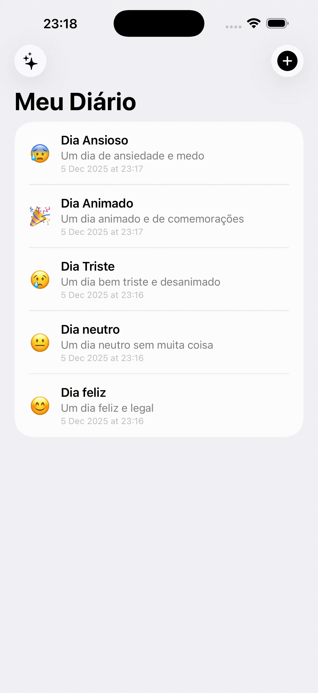
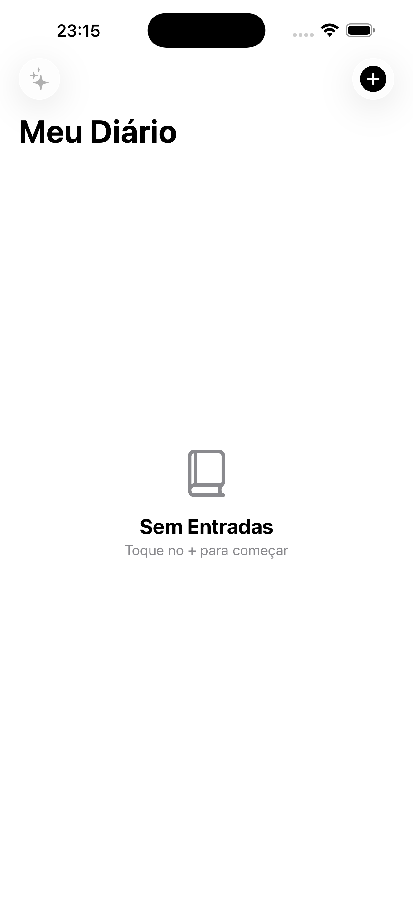
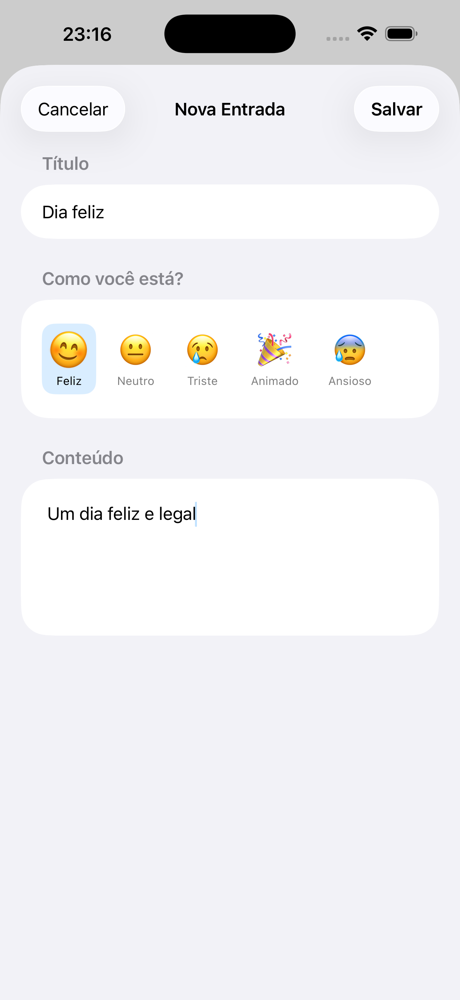
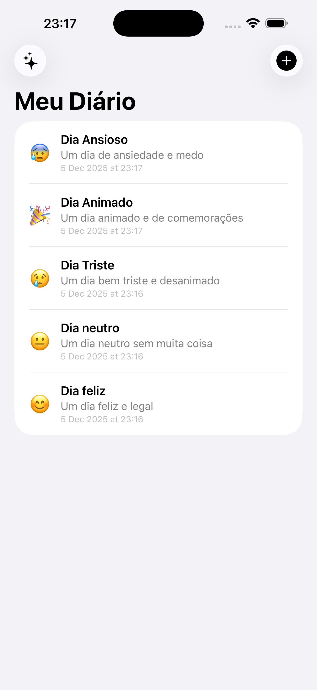
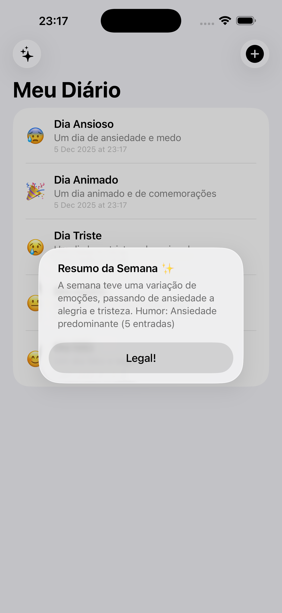

# Diário

<p align="center">
  
  
  
  
</p>

<p align="center">
  Um aplicativo de diário pessoal simples e intuitivo, desenvolvido em SwiftUI com foco em experiência do usuário através de animações suaves e integração com inteligência artificial.
</p>

---

## Preview

<p align="center">
  
</p>

<p align="center">
  
  
  
  
</p>

---

## Funcionalidades

- **Criar entradas** com título, conteúdo e humor
- **Seleção de humor** com emojis animados
- **Visualizar e editar** entradas existentes
- **Excluir entradas** com swipe
- **Animações de confetti** ao salvar
- **Resumo semanal** gerado por inteligência artificial
- **App Intents** para integração com o app Atalhos

---

## Tecnologias Utilizadas

### FoundationModels (Apple Intelligence)

O app utiliza o framework `FoundationModels` para gerar resumos semanais das entradas do diário usando inteligência artificial on-device.

```swift
import FoundationModels

@Generable
struct WeeklySummary {
    var resumo: String
    var humorPrincipal: String
    var totalEntradas: Int
}

class AIService {
    private let session = LanguageModelSession()
    
    func generateSummary(for entries: [DiaryEntry]) async -> String {
        let prompt = "Gere um resumo das entradas: \(entries.map { $0.content })"
        let response = try? await session.respond(to: prompt, generating: WeeklySummary.self)
        return response?.content.resumo ?? "Resumo não disponível"
    }
}
```

**Onde está implementado:** `Services/AIService.swift`

---

### AppIntents

Integração com o app Atalhos da Apple, permitindo criar entradas e consultar o diário através de automações.

```swift
import AppIntents

struct CreateDiaryEntryIntent: AppIntent {
    static var title: LocalizedStringResource = "Criar Entrada no Diário"
    
    @Parameter(title: "Título") var title: String
    @Parameter(title: "Conteúdo") var content: String
    
    func perform() async throws -> some IntentResult {
        let entry = DiaryEntry(title: title, content: content, mood: .feliz)
        DiaryViewModel().addEntry(entry)
        return .result()
    }
}
```

**Onde está implementado:** `Intents/DiaryAppIntents.swift`

**Intents disponíveis:**
| Intent | Descrição |
|--------|-----------|
| `CreateDiaryEntryIntent` | Cria uma nova entrada no diário |
| `GetLastEntryIntent` | Retorna a última entrada registrada |

---

### Animações

O app utiliza animações sutis para melhorar a experiência do usuário.

#### ConfettiSwiftUI
Biblioteca externa para animação de confetti quando uma entrada é salva.

```swift
.confettiCannon(
    trigger: $confettiCounter,
    num: 50,
    colors: [.purple, .pink, .blue, .yellow, .green]
)
```

#### Animações Nativas

| Animação | Uso | Código |
|----------|-----|--------|
| `.bouncy` | Seleção de humor | `withAnimation(.bouncy)` |
| `.smooth` | Transições de lista | `.animation(.smooth, value:)` |
| `.snappy` | Toast de feedback | `withAnimation(.snappy)` |
| `symbolEffect` | Botão de adicionar | `.symbolEffect(.bounce)` |

---

## Dependências

| Pacote | Uso |
|--------|-----|
| [ConfettiSwiftUI](https://github.com/simibac/ConfettiSwiftUI) | Animação de confetti |

---
